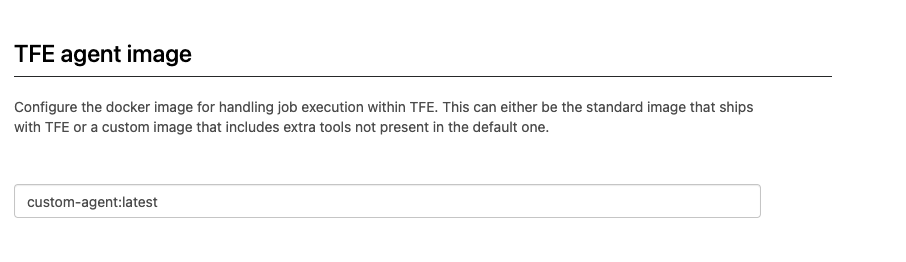

# manual steps for creating a TFE external with a custom agent

With the release of Terraform Enterprise Februari 2023 (v202302-1 (681)) the custom worker is changed and you must switch to the new agent based image before the release of may 2023

See here for the details https://developer.hashicorp.com/terraform/enterprise/admin/infrastructure/worker-to-agent-migration

This repository is based on the following https://github.com/munnep/TFE_aws_external for creating the default TFE environment

# Configure the TFE environment to use a custom agent

- Create the TFE environment
- Login to the TFE environment
- Use the following dockerfile as an example
```
# This Dockerfile builds the image used for the worker containers.
FROM hashicorp/tfc-agent:latest

USER root

# install the Azure cli tool
RUN apt-get update \
    && apt-get install --no-install-recommends -y ca-certificates curl apt-transport-https lsb-release gnupg \
    && curl -sL https://packages.microsoft.com/keys/microsoft.asc | gpg --dearmor | tee /etc/apt/trusted.gpg.d/microsoft.gpg > /dev/null \
    && AZ_REPO=$(lsb_release -cs) \
    && echo "deb [arch=amd64] https://packages.microsoft.com/repos/azure-cli/ $AZ_REPO main" | tee /etc/apt/sources.list.d/azure-cli.list \
    && apt-get update \
    && apt-get install -y azure-cli
````    

- Build the docker image using this dockerfile
```
docker build -t custom-agent .
```
- Change the following values for Terraform Enterprise

```
replicatedctl app-config set run_pipeline_mode --value "agent"
replicatedctl app-config set custom_agent_image_tag --value "custom-agent:latest"
```

- Restart TFE to make the new settings being used

```
replicatedctl app stop
replicatedctl app start
```

- See the new settings in the dashboard  
  

- When doing a run with the following code you should see this output

```
resource "null_resource" "test" {
  provisioner "local-exec" {
    command = "az --version"
  }
}
```

    
