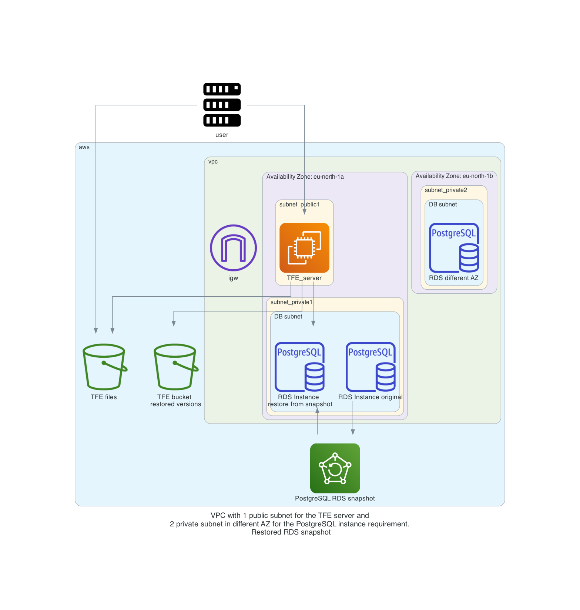

# Terraform Enterprise restore snapshot

This manual shows an example of creating a snapshot of the PostgreSQL RDS environment. After that you are able to restore the environment to this PostgreSQL environment and restore the S3 bucket to the same point in time. 

The TFE environment external services consist of 3 components

- TFE instance
- S3 bucket
- PostgreSQL database

When it comes to backup and restore we consider the following

## TFE instance

The TFE instance is just a server instance with docker and the TFE application. With the external services configuration which is the default of this repository there isn't any application data stored on the server. It can all be destroyed and recreated. 

## S3 bucket
TFE application stores the logs for Terraform plan/apply and the state files in this bucket in an encrypted format. If you need to restore your TFE environment to a previous point in time you must restore all the files in this bucket.

This repository has versioning enabled on this bucket which enables us to restore to bucket files to a previous point in time. 

## PostgreSQL database
The database stores important information of the TFE environment. You will need to be able to restore the RDS database to a previous point in time. We can do that by creating snapshots (backups) of the RDS environment. Example would be to do this before doing an upgrade of the TFE environment

# Diagram 

Original environment  
  

Environment after a restore  
  


# Prerequisites

## s3-pit-restore
To restore the files in an S3 bucket we use an external script called s3-pit-restore. Please see the following repository [here](https://github.com/angeloc/s3-pit-restore) to install this tool on your machine

# How to

- You currently have a working TFE environment 
- Make a snapshot of the RDS environment by adding the following value to your `variables.auto.tfvars`
```
rds_snapshots = ["before-upgrade"]
```
- run terraform apply
```
terraform apply
```
- You now have a snapshot created of your database environment. You can make changes to your TFE application. 
```
make changes in your TFE application
```
- Restore the snapshot by adding the following value to your `variable.auto.tfvars`
```
rds_snapshot_to_restore = "before-upgrade"
```
- Run terraform apply
```
terraform apply
```
- You now have a running PostgreSQL environment restored. You need to restore the S3 bucket to the same point in time. The output shows the example code for the `s3-pit-restore` command
```
Apply complete! Resources: 1 added, 1 changed, 0 destroyed.

Outputs:

restore_s3_bucket_to_rds_snapshot = "s3-pit-restore -b patrick-tfe3-bucket -B patrick-tfe3-bucket -t 11-27-2022 14:42:42 +1"
```
- Use the `s3-pit-restore` to restore the s3 bucket to the same time. Watch the "" in the end
```
s3-pit-restore -b patrick-tfe3-bucket -B patrick-tfe3-bucket -t "11-27-2022 14:42:42 +1"
```
- Destroy and create the TFE instance to point to the new RDS database
```
terraform apply -replace=aws_ebs_volume.tfe_docker -replace=aws_ebs_volume.tfe_swap -replace=aws_instance.tfe_server
```
- When the TFE instance is back up and running you should see it is using the new RDS environment in the TFE dashboard -> settings  
    


